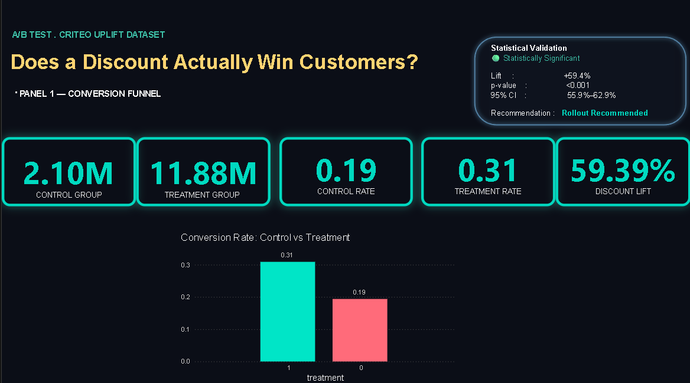
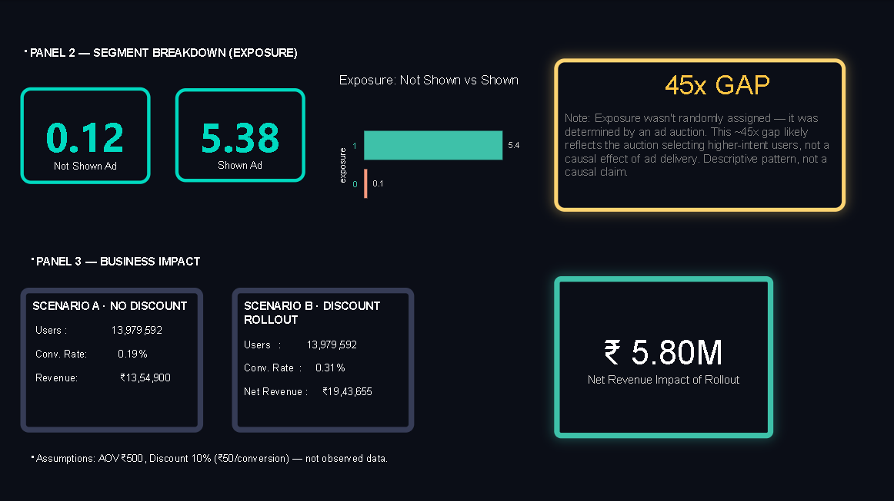

# A/B Testing Analysis: Does a Discount Actually Win Customers, or Just Attract Deal Seekers?

An end-to-end A/B test analysis using the **Criteo Uplift Modeling Dataset**, built with **SQL, Power BI, and Excel** to evaluate whether a discount campaign genuinely increases conversions and business revenue.

---

# Business Question

Companies frequently launch discount campaigns and judge success solely by whether conversions increase.

However, a higher conversion rate alone doesn't answer the real business question:

> Does the discount create genuinely new customers, or does it simply give discounts to customers who would have purchased anyway?

This project answers that question using a real randomized experiment rather than assumptions.

---

# Dataset

**Source:** Criteo Uplift Modeling Dataset

- 13.98 million observations
- Randomized Treatment and Control groups
- Real advertising experiment
- Conversion outcome for every user

The entire analysis was performed using:

- SQL (SQLite)
- Power BI
- Excel

No Python was used in this project.

---

# Methodology

Instead of simply comparing conversion rates, I validated the experiment step by step.

## 1. Power Analysis

Before analyzing results, I calculated the minimum sample size required to detect a meaningful effect.

- Baseline conversion: **0.19%**
- Minimum Detectable Effect (MDE): **10%**
- Required sample size: **≈820,000 users per group**

Actual experiment:

- Control: **2.1M**
- Treatment: **11.9M**

The experiment was comfortably powered.

---

## 2. Randomization Check

I verified that the treatment allocation was reasonable.

- Control: **15%**
- Treatment: **85%**

Although the split wasn't 50/50, it reflects Criteo's experimental design rather than a data issue.

---

## 3. Primary A/B Test Results

| Metric | Control | Treatment |
|--------|---------|-----------|
| Conversion Rate | 0.19% | 0.31% |

### Statistical Results

- Relative Lift: **+59.4%**
- p-value: **< 0.001**
- 95% Confidence Interval: **55.9%–62.9%**

The increase in conversions is statistically significant.

---

## 4. Exposure Analysis

Within the treatment group, I compared users who actually saw the advertisement with those who did not.

Although exposed users converted substantially more often, exposure itself was **not randomly assigned**.

Therefore, this analysis is presented as a descriptive observation rather than causal evidence.

---

## 5. Business Impact

The dataset contains no revenue values.

To estimate financial impact, I assumed:

- Average Order Value: **₹500**
- Discount: **10%**

Using these assumptions, I built an Excel model comparing:

- No Discount Strategy
- Discount Campaign

Even after accounting for discount costs, the campaign produced higher estimated net revenue.

---

# Key Findings

- Discounts produced a statistically significant increase in conversions.
- The conversion lift represents genuine incremental impact.
- Exposure analysis highlights why top-line metrics alone can be misleading.
- The campaign remained profitable after incorporating discount costs.

---

# Dashboard

The Power BI dashboard contains three analytical sections:

- Conversion Funnel
- Statistical Validation
- Business Impact Analysis

## Dashboard Overview



## Business Impact Dashboard



---

# Limitations

- Feature columns (f0–f11) are anonymized.
- Revenue calculations are based on an assumed Average Order Value.
- Exposure analysis is descriptive rather than causal.

---

# Tools Used

- SQL (SQLite)
- Power BI
- Excel

---

# Repository Structure

```text
├── SQL/
├── EXCEL/
├── Power BI/
├── Outputs/
└── README.md
```
